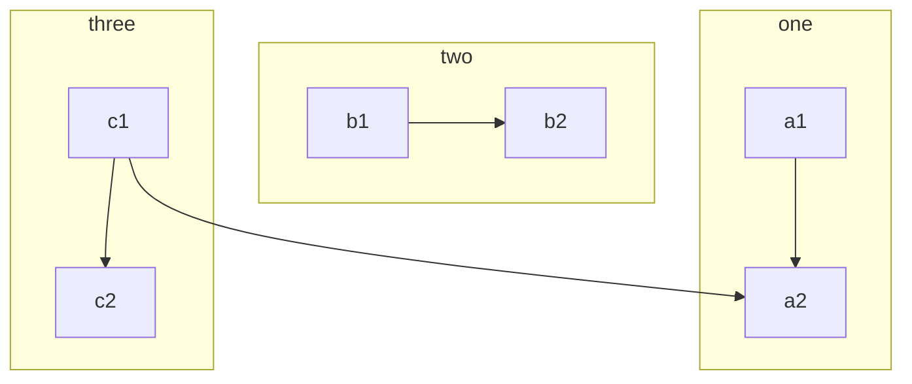
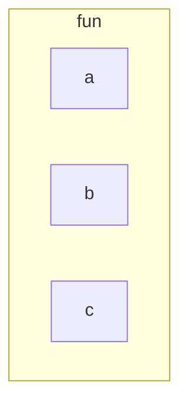

# JFLAP

An equivalence relation, is one that satisfies reflexivity, symmetry, and transitivity.
If there exists a positive constant c such that for all sufficiently large n  
$f (n) ≤ c|g (n) |$,  
we say that f has order at most g. We write this as  
$f (n) = O (g (n)).$  
If  
$|f (n)| ≥ c |g (n)|$
then f has order at least g, for which we use  
$f (n) = \Omega(g (n))$.  
Finally, if there exist constants c1 and c2 such that  
$c1 |g (n)| ≤ |f (n)| ≤ c2 |g (n)|$,  
f and g have the same order of magnitude, expressed as  
$f (n) = \Theta(g (n))$.  
In this order-of-magnitude notation, we ignore multiplicative constants and lower-order terms that  
become negligible as n increases.

### 1.2 Language
If $\Sigma$ is an alphabet, then we use $\Sigma^\ast$ to denote the set of strings obtained by concatenating zero or  more symbols from $\Sigma$. The set $\Sigma^\ast$ always contains $\lambda$. To exclude the empty string, we define
$$\Sigma^+= \Sigma^* - \lambda$$

While $\Sigma$ is finite by assumption, $\Sigma^*$ and $\Sigma^+$ are always infinite since there is no limit on the length of  the strings in these sets. A language is defined very generally as a subset of $\Sigma^*$. A string in a language  $L$ will be called a sentence of $L$. This definition is quite broad; any set of strings on an alphabet $\Sigma$  can be considered a language.

**Grammar**
A grammar G is defined as a quadruple  
$$G = (V, T, S, P),$$  
where $V$  is a finite set of objects called **variables**,  
$T$ is a finite set of objects called terminal **symbols**,  
$S ∈ V$ is a special symbol called the start **variable**,  
$P$ is a finite set of **productions**.  
It will be assumed without further mention that the sets $V$ and $T$ are **nonempty and disjoint**.

The production rules are the heart of a grammar; they specify how the grammar transforms one  string into another, and through this they define a language associated with the grammar. In our  discussion we will assume that 
**all production rules are of the form  $x \rightarrow y$,  where x is an element of $(V \cup T)^+$ and y is in $(V ∪ T)^\ast$. The productions are applied in the  following manner: Given a string w of the form  
$$w = uxv$$**
we say the production $x \rightarrow y$ is applicable to this string, and we may use it to replace $x$ with $y$,  thereby obtaining a new string  $z = uyv$.  This is written as  $w \Rightarrow z$.  

We say that $w$ derives $z$ or that $z$ is derived from $w$. Successive strings are derived by applying the  productions of the grammar in arbitrary order. A production can be used whenever it is applicable,  and it can be applied as often as desired. If  $w_1 \Rightarrow w_2 \Rightarrow \cdots ⇒ w_n$,  we say that $w_1$ derives $w_n$ and write  The $\ast$ indicates that an unspecified number of steps (including zero) can be taken to derive $w_n$ from  $w_1$.  

By applying the production rules in a different order, a given grammar can normally generate  many strings. The set of all such terminal strings is the language defined or generated by the  grammar.

Let $G = (V, T, S, P)$ be a grammar. Then the set
$$L(G) = \{\omega \in T^\ast : S \Rightarrow^\ast \omega \}  $$
$$ a := x^2-y^3 \tag{3-3}$$

### 

### Turing Machine
$$
\begin{aligned}
M = (Q, \Sigma, \Gamma, \delta, q_0, \square,F)\tag{1}
\end{aligned}
$$
where 
$$Q \quad \text{is the set of internal states} $$
$$
	\Sigma \quad \text{is the input alphabet}  
$$
$$
	\Gamma \quad \text{is a finite set of symbols called the tape alphabet}
$$
$$
	\delta \quad \text{is the transition function}
$$
$$
	\square \in \Gamma \quad \text{is a special symbol called the blank}
$$
$$
	q_0 \in Q \quad \text{is the initial state}
$$
$$
	F \subseteq Q \quad \text{is the set of final states}
$$
In the definition of a Turing machine, we assume that $\Sigma \subseteq \Gamma - \{\square\}$, that is, that the input alphabet  is a subset of the tape alphabet, not including the blank. Blanks are ruled out as input for reasons that will become apparent shortly.
The transition function is defined as:equation (3-3)
$$
	Q \times \Gamma \rightarrow Q \times \Gamma \times \{L, R\}
$$
The result is a new state of the control unit, a new tape symbol, which replaces  the old one, and a move symbol, L or R.

$$
	\delta(q_0, a) = (q_1, d, R)
$$
The only actions the turing machine can perform are to rewrite the current symbol, to change the state of the control, and to move the read-write head.
The transition function $\delta$ defines how this computer acts and we often call it the **"program" of the machine**.

Consider the Turing machine defined by
$$
\begin{aligned}
Q &= \{ q_0, q_1\}  \\
\Sigma &= \{a, b \} \\
\Gamma &=\{a, b, \square \} \\
F &= {q_1}
\end{aligned}
$$
$$
\begin{aligned}
Q &= \{ q_0, q_1\}  \\
\Sigma &= \{a, b \} \\
\Gamma &=\{a, b, \square \} \\
F &= {q_1}
\end{aligned}
$$
图灵机计算x + y
$$
q_0\omega (x)0 \omega(y)\overset{\ast}{\vdash } q_f \omega(x+y)0  \\
\delta (q_0, 1) = (q_0, 1 , R)                 \\
\delta (q_0, 0) = (q_1, 1 , R)                 \\
\delta (q_1, 1) = (q_1, 1 , R)                 \\
\delta (q_1, \square ) = (q_2, \square , R)    \\
\delta (q_2, 1) = (q_3, 0 , L)                 \\
\delta (q_3, 1) = (q_3, 1 , L)                 \\
\delta (q_3, \square) = (q_4, \square, R)     
$$

$$
\dagger \\
\mathbf{A}_k^{\bigstar}  \\
\ast
$$
$$
\cup \\
\cap
$$

An **algorithm** for a function $f : D \rightarrow R$ is a Turing machine $M$, which given as input any $d \in R$  on its tape, eventually halts with the correct answer $f (d) \in R$ on its tape. Specifically, we can  require that  
$$
q_0d \overset {\ast}{\vdash} M q_f f(d), q_f \in R,  
$$
for all $d \in D$.

The *Gamma function* satisfying $\Gamma(n) = (n-1)!\quad\forall n\in\mathbb N$ is via the Euler integral

$$ log_2 10$$
$$ \Sigma_{i=1}^n \frac{1}{i^2} < 2 - \frac{1}{n}$$
> Written with [StackEdit](https://stackedit.io/).
> 
$$
\stackrel{\frown}{MM'}
$$
$A \mathop{+}_{\text{below}}^{\text{above}} C$
<!--stackedit_data:
eyJoaXN0b3J5IjpbMTY5MTAyMTQwXX0=
-->